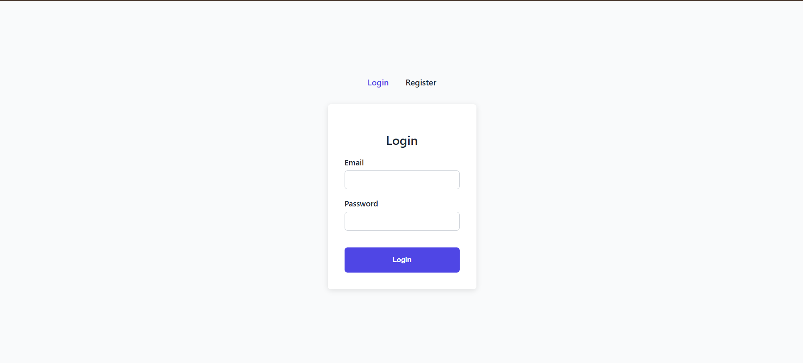
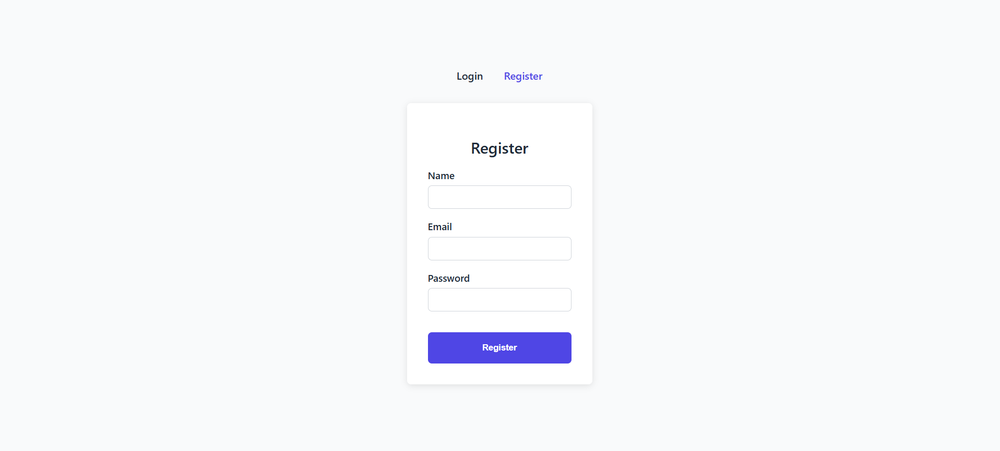

# project-react

A clean, accessible Login & Registration page built with React, TypeScript, React Hook Form, Zod validation, React Router, and plain CSS.

---

## Features

- **React + TypeScript** for type-safe, scalable code  
- **React Hook Form** for performant form management  
- **Zod** for schema-based form validation with typed errors  
- **React Router v6** for client-side routing (Login & Register pages)  
- **Plain CSS** with CSS variables and BEM naming for maintainable styles  
- Accessibility best practices: semantic HTML, focus states, labels  
- Responsive design for mobile and desktop  
- No CSS frameworks or CSS-in-JS — plain CSS files only  

---

## Getting Started

### Prerequisites

- Node.js (v14 or newer recommended)  
- Yarn or npm  

### project Structure

```plaintext
src/
├── components/               # Reusable UI components (TextInput)
│   └── TextInput.tsx
│   └── TextInput.css
├── pages/                    # Page components (LoginPage, RegisterPage)
│   └── LoginPage.tsx
│   └── LoginPage.css
│   └── RegisterPage.tsx
│   └── RegisterPage.css
├── validation/               # Zod schemas for form validation
│   └── schemas.ts
├── App.tsx                   # Main app component with routing
├── App.css                   # Global styles & variables
├── index.tsx                 # App entry point
├── screenshot/               # Screenshots for submission
│   └── Screenshot-Login.png
│   └── Screenshot-Register.png
```
### Installation

1. Clone the repo

   ```bash
   git clone https://github.com/mengfoong/project-react.git
   cd project-react

2. Install dependencies

    ```bash
    yarn install

3. Start development server on port 3333, then fo to http://localhost:3333

    ```bash
    yarn start

## Screenshots

### Login Page



### Register Page



